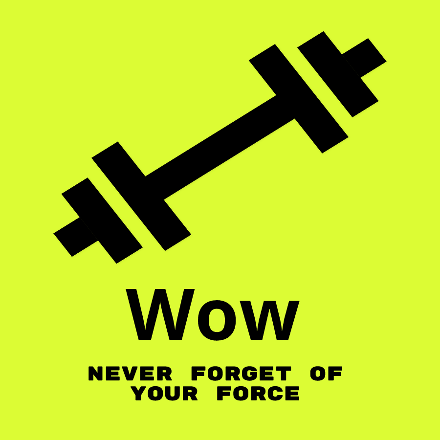
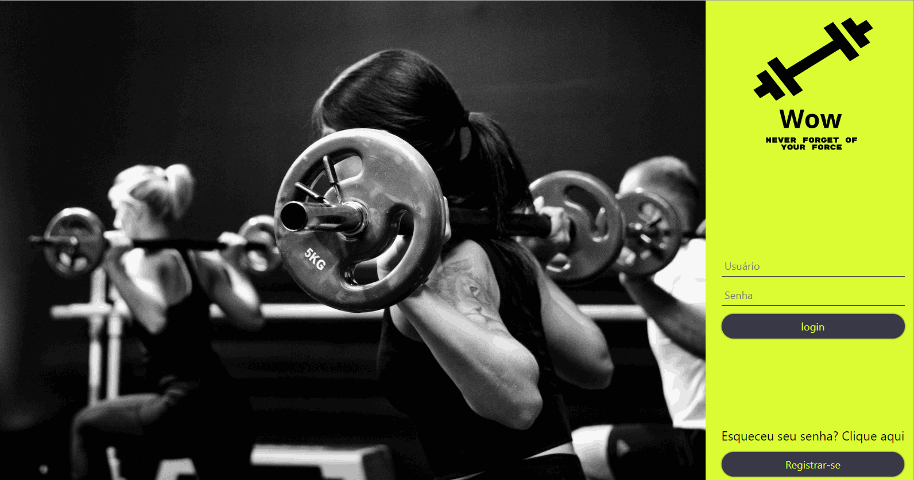
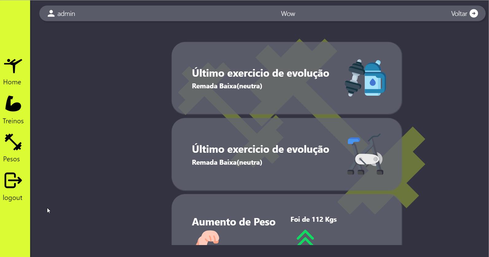
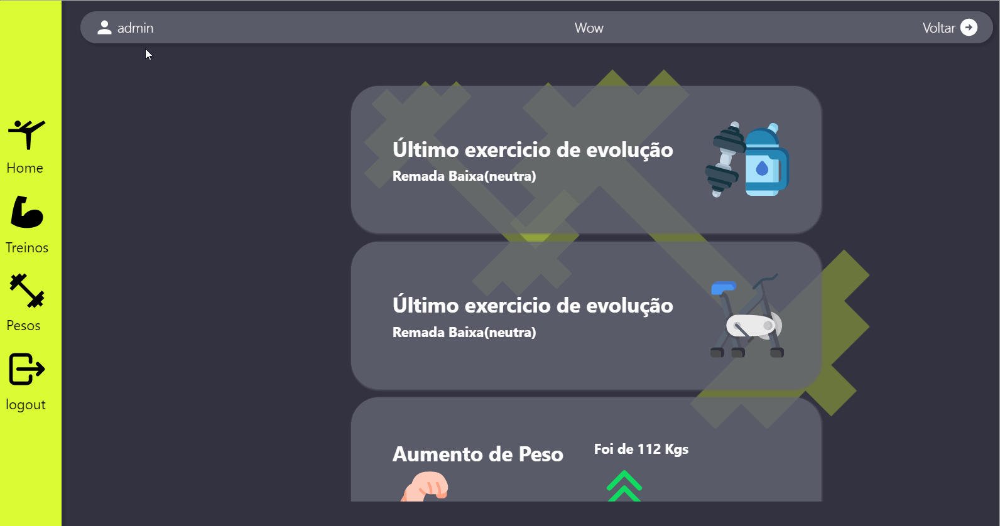

<h1>WayOftheWeights-FRONT-END 🏋🏽‍♂️<h1>

### Indice 👨‍💻

 <li> <a href="#introdução">1 - 🚪Introdução</a> •</li>
 <li> <a href="#desenvolvimento">2 - ⚙️ Desenvolvimento e Tecnologias</a> • </li>
 <li> <a href="#instalar">3 - 👇🤘 Como instalar</a> • </li>
 <li> <a href="#usar">4 - 🤘Como Usar</a> • </li>
 <li> <a href="#consideraçoesfinais">5 - Considerações finais </a> • </li>
 <li> <a href="#autor">6 -🧑‍💻 Autor</a> • </li>
 <li> <a href="#licensa"> 7- Licença</a> • </li>

## Edições ✏️📑

|             Alterações             |   Data   | Versão |
| :--------------------------------: | :------: | :----: |
| Emissão Inicial | 31/10/22 | 1.0.1  |

<h2 id='introdução' color=green ><b>1 - Introdução</b></h2>

Bom, eu criei um novo projeto ao voltado para treinos de academia, invés de ter sua ficha em papel, ela na verdade está em um software. Do modo que estou falando parece que nem existe no mercado 🤦🏽‍♂️😅😂. Mas enfim, ao longo das academias que eu passei, sentir uma falta funcionalidade gerenciamento de cargas e acompanhamento delas. Com base nisso criei está solução, que acompanha um gráfico simples de evolução da força do esportista ao longo do seu aumento de carga em Quilogramas. Como e visto abaixo.

<h2 id='desenvolvimento'><b>2- Desenvolvimento e Tecnologias 🥵🧑‍🏭 </b></h2>

Não tive trabalhos para realizar essa aplicação tem uma, creio foi um dos melhores front-end que já criei, se não o melhor tirando algumas coisa inputs repitidos e não convertidos em componentes __Way of the Weights__ tem uma das melhores validação de dados de inputs que já creio, claro com
o auxilio do **react hook form**, uma biblioteca excelente para tal. Criei gráficos com Recharts. Troquei devido a antiga que usava não ter uma documentação muito boa.

### 👥 Principais Tecnologia usadas até o momento

**• Typescript**
**• React**
**• React-hook-forms**
**• Recharts**

<h2 id='instalar'><b>3- Como instalar 🧑‍🔧</b></h2>

1. Clone o projeto
1. Digite npm start no ambiente de desenvolvimento ou npm run build para rodar o projeto.

<h2 id='usar'><b>4- Como usar 👩‍💻</b></h2>
 

1.  Registrar no app: Clique no botão registrar para criar sua conta.

 
 

2.	Login no App: Coloque seu usuário e senha para se logar.

 
 

3.	Esqueci minha senha: Caso aconteça clique em esqueci minha senha para criar uma nova.

 
 

4.	Tela inicial Dashboard: Onde está localizado os dados do último exercício.

 
 

5.	Treinos do usuário: Nessa lista todos os treinos do usuário. Nela também poderá adicionar, deletar (caso não tenha um exercício), editar um treino e ao clicar no card poderá ver os exercícios daquele treino.

 
 

6.	Exercício do treino: Ao clicar em um treino, lista todos os exercícios daquele treino. Nela também poderá adicionar, deletar, editar um treino e ao clicar no card poderá ver os detalhes aquele exercício clicado.

 
 

7.	Exercícios de demonstrativos evolução: Há quanto qual a carga que o usuário está carregando naquele momento. Abaixo haverá um gráfico demostrando à evolução as trocadas ao longo do tempo daquele exercício. Esse gráfico e alimentado pelos desde a criação do exercício até os futuros update é trocas de cargas efetuadas pelo usuário.

 

8.	Pesos: Mostra alguns utilizados pela aplicação ao todo somente temos 250 Quilogramas, mas futuramente poderemos aumentar mais.

 

9.	Área do Usuário: Essa área o usuário poderá mudar seus dados cadastrados anteriormente como queira.
10.	Bom, o foco desse aplicativo é mensurar o ganho de força do usuário.
 

<h3>👉🏽<a href='https://way-of-the-weights-front-end.vercel.app'>Clique aqui crie seu usuario para testar em tempo real</a></h3>

<h2 id='consideraçoesfinais'><b>5 -🥺😭 Considerações finais</b></h2>

Ahhh, mas você já vai ir embora 😢 ...

Esse projeto foi voltado para o acompanhamento da evolução da força do Usuário que pratica algum esporte físico.
O codigo foi melhorado ao máximo. Amei usar a biblioteca **React-hook-form** no front-end.

<h2 id='autor'><b>6- Autor ✍🏻</b></h2>

 <b>Joao Guilherme</b></h4> <a href="https://github.com/JoaoG23/">🚀</a>

Feito com 🤭 por Joao Guilherme 👋🏽 Entre em contato!

<h2 id='licenca'><b>7 - Licença</b></h2>

